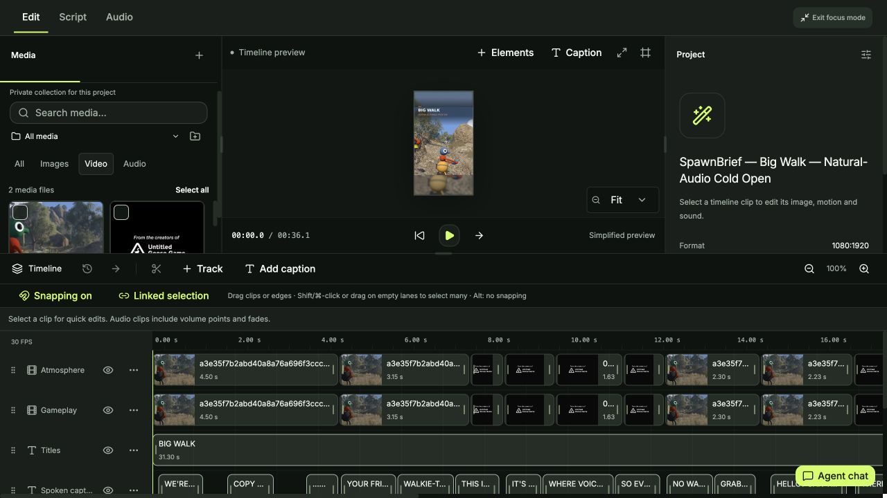
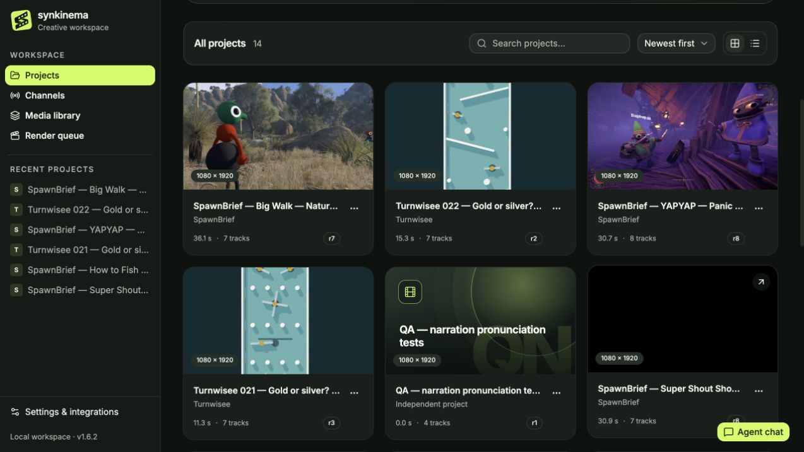
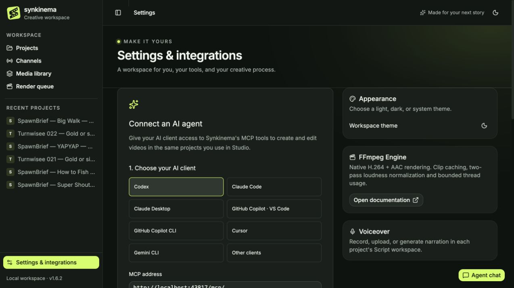
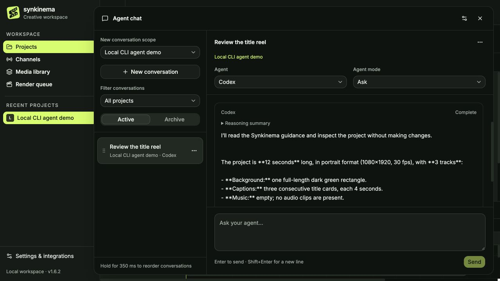
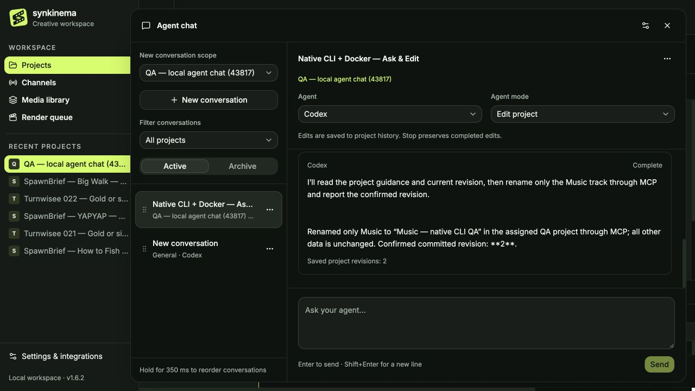
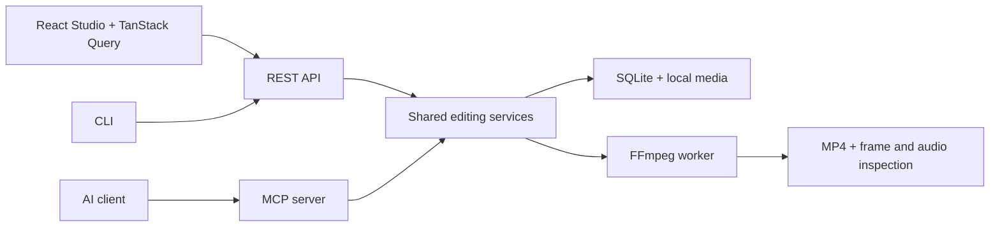

<p align="center"></p>

<h1 align="center">Synkinema</h1>

**Local video editing for people and agents.**

Build a reel by hand, chat with a local CLI agent inside Studio, or connect an AI
client through MCP—all on the same project. Synkinema combines a desktop video
editor with a headless FFmpeg engine, REST API, MCP server and CLI. Your projects,
media, revisions and exports stay on your machine. Manual editing requires no
account; AI agents use your provider's login.

## One project. Your edit. Your agent.

Start a project in Studio, shape the cut by hand, then open **Agent chat** or bring
in an AI client through MCP. You and your agent work on the same local project and
editable timeline; revision history and undo keep every change under your control.

<p align="center">
  <a href="assets/screenshots/timeline-dark.jpg"></a>
</p>

<p align="center"><em>Media, preview and a multi-track edit—together in Studio's focus mode.</em></p>

| Start with a real project | Bring an agent into the same workspace |
| --- | --- |
| <a href="assets/screenshots/projects-dark.jpg"></a><br><strong>Keep every production in view.</strong><br>Create, browse and reopen projects without losing their context. | <a href="assets/screenshots/agent-workspace-dark.jpg"></a><br><strong>One project, two ways to edit.</strong><br>Connect Codex or another MCP client so it can create and refine the same projects you use in Studio. |

[](https://github.com/dziksu/synkinema/actions/workflows/ci.yml)
[](LICENSE)
[](https://github.com/dziksu/synkinema/releases)

[In action](#one-project-your-edit-your-agent) · [Quick start](#quick-start) · [Features](#what-you-can-make) ·
[Agent chat](#in-app-agent-chat) · [Connect through MCP](#mcp-and-agents) · [Documentation](docs/README.md) ·
[Development](#development) · [Contributing](CONTRIBUTING.md)

## Quick start

### Docker with your local CLI agents

To use the built-in chat with **Codex, Claude Code or Copilot installed and signed
in on your computer**, install Docker and curl, and start your Docker engine
(Docker Desktop or Colima).

**Moving an existing Compose installation to this mode?** Finish any running
renders or agent turns, then run `docker compose stop synkinema` in its checkout
**before** the installer. This keeps the `synkinema_synkinema-data` volume and
your projects/media. The launcher needs exclusive access to that volume and
port 43817; changing only the port does not resolve a shared-volume conflict.

Then run:

```sh
curl -fsSL https://github.com/dziksu/synkinema/releases/latest/download/synkinema-local-install.sh | sh
```

The installer verifies SHA-256, installs a standalone launcher for macOS/Linux
arm64/x64, and starts the matching Docker image. **No cloning, Python, Node.js or
local FFmpeg installation is needed.** The selected release must include the
launcher assets and a publicly readable matching GHCR image.

Open **[http://localhost:43817](http://localhost:43817)**, then **Agent chat →
Agent settings**. The localhost gateway runs your native CLI with its existing
login and proxies Studio/API/media to a private Docker backend on port 43818.
Projects/media/exports stay in **`synkinema_synkinema-data`**; chat and settings
live in **`~/.local/share/synkinema/chat`**. Existing Docker conversations are
copied once, keeping the originals. CLI credentials are never mounted into Docker.

Keep the terminal open. **Ctrl+C** stops the launcher, agents and its managed
container while retaining projects, media and conversations. Start again with:

```sh
~/.local/share/synkinema/synkinema-local
# In another terminal:
~/.local/share/synkinema/synkinema-local status
~/.local/share/synkinema/synkinema-local stop
```

The launcher refuses occupied ports, foreign containers and a volume already
used by another running container. If installation succeeded but startup failed,
fix the reported problem and rerun the installed launcher; no reinstallation is needed.
If your earlier `docker run` used `synkinema-data`, pass `--volume synkinema-data`.
Use `--port 43819`, `--backend-port`, `--data-dir`, `--read-only` and `--no-open`
as needed. If pulling the matching image reports `unauthorized`, `denied` or
`manifest unknown`, see [launcher troubleshooting](docs/LOCAL_AGENT_CHAT.md#launcher-troubleshooting).
To update, stop the launcher and rerun the installer; helper and image
versions must match. See [local launcher details](docs/LOCAL_AGENT_CHAT.md#docker-with-agents-on-the-host).

### Docker engine and external MCP clients

With Docker installed and running, start the published image. **No cloning, Python,
Node.js or local FFmpeg installation is needed:**

```sh
docker run -d --name synkinema --init \
  -p 127.0.0.1:18080:8080 \
  -v synkinema-data:/data \
  --restart unless-stopped \
  ghcr.io/dziksu/synkinema:latest
```

Open **[http://localhost:18080](http://localhost:18080)** and create a project.
The first run downloads the image. Projects, media, models and exports persist in
the `synkinema-data` Docker volume; restarting the container keeps them.

> The command requires a published, publicly readable GHCR image. Before the first
> release, or if you get `denied` / `manifest unknown`, use the
> [source build](#build-from-source). See [releases](https://github.com/dziksu/synkinema/releases)
> and [image troubleshooting](docs/DEPLOYMENT.md#startup-troubleshooting).

Check startup:

```sh
docker logs --tail 100 synkinema
curl --fail http://localhost:18080/api/health
```

Run `docker start` after stopping an existing container; repeating `docker run`
with the same name will fail. If host port 18080 is occupied, use
`-p 127.0.0.1:18081:8080` and port **18081** in your browser and MCP client.

The default setup is local and single-user, with no login. Keep it on localhost
unless you deliberately configure [trusted network access](docs/DEPLOYMENT.md#trusted-home-network).
For upgrades, pin a published `vX.Y.Z` tag or digest and keep the same volume.
The release workflow builds Linux images for AMD64 and ARM64.

| Endpoint | Purpose |
|---|---|
| `/` | Studio |
| `/api/docs` | Swagger UI |
| `/redoc` | API reference |
| `/api/openapi.json` | Generated OpenAPI contract |
| `/mcp/` | MCP Streamable HTTP |
| `/api/health` | Version, FFmpeg and ffprobe availability |

### Build from source

For development or before a public image is available:

```sh
git clone https://github.com/dziksu/synkinema.git
cd synkinema
docker compose up --build -d
```

If you already have a checkout, run only the last command there. Once an image is
published, `docker compose -f compose.release.yaml up -d` uses it without building.
The default Compose mapping is `127.0.0.1:43817:8080`; open
`http://localhost:43817` after starting it. To restore an existing
Compose installation without rebuilding, run `docker compose up -d synkinema` in
the same checkout; it keeps the existing Compose volume.
Compose normally uses **`synkinema_synkinema-data`**, a different volume from the
standalone command's **`synkinema-data`**. Reuse the original volume when moving an
existing installation; see [deployment and backups](docs/DEPLOYMENT.md).

## Your first video

1. Open **Projects**, create a project and choose its output profile.
2. Upload footage into **Project media**, or add reusable assets from **Library**.
3. Drag a source onto the preview to insert it at the playhead. Trim it on the
   timeline and position layers on the canvas. Add separate tracks for simultaneous
   overlays or captions; ordinary clips cannot overlap on one track.
4. Add captions, then import narration or generate a take in **Script → Voiceover**.
   Video tracks are silent: extract source audio or add it to an audio track to
   include it in the mix. Add music and sound effects as separate layers.
5. Export a short preview, inspect it, then render the final video. Play and download
   the result from the project's **Exports** tab or the global **Render queue**.

Follow the [manual editing guide](docs/MANUAL_EDITING.md) for source ranges, canvas
controls and audio. To work through an agent, follow the
[first MCP reel walkthrough](docs/AGENT_QUICKSTART.md).

## What you can make

| Workflow | Included capabilities |
|---|---|
| Desktop editing | Multi-track video, images, captions, overlays, narration, music and SFX; drag and drop, trimming, splitting and source audio extraction |
| Canvas and motion | Position and resize layers, picture-in-picture, split layouts, caption presets, zoom, blur, color adjustments, keyframes and transitions |
| Media organization | Private project collections, shared library folders, tags, attribution and reference-aware deletion of owned files |
| Speech and captions | Optional local Supertonic 3 TTS; local Whisper transcription and approximate word alignment through production tasks; imported voice or optional ElevenLabs BYOK |
| Agent production | Steam discovery and trailer import, public direct/HLS media import, source-frame inspection, batched narration, procedural music and editable showcase composition |
| Export | 16 [output presets](docs/EXPORT_FORMATS.md), 720p through 4K, portrait and landscape, up to 60 FPS, quality and fit/fill controls; H.264/AAC MP4 |
| Quality review | Exact-export frames, full decode checks, loudness, independent speech recognition, caption bounds and delivery bundles with MP4/SRT/project/provenance |
| Human + agent editing | Shared projects, revision guards, atomic batches, dry runs, history and undo across the UI and headless workflows |
| In-app agent chat | Local Codex, Claude Code and Copilot CLIs; project-scoped Ask and Edit project modes, live replies, saved conversations, archive/restore and stop controls |

The interface defaults to **English**; scripts, captions and project names can use
other languages. Desktop mouse and keyboard workflows are the current focus.
Your CLI agent or AI client supplies the reasoning and script writing. Synkinema
supplies the editing tools, local media processing and durable production jobs.

## In-app agent chat

Open **Agent chat** in the bottom-right corner of Studio to talk to **Codex CLI,
Claude Code or GitHub Copilot CLI** without leaving the editor. Start a general
conversation or attach it to a project; a project conversation keeps its scope
when you navigate elsewhere in the app.

<p align="center">
  <a href="assets/screenshots/local-agent-chat-dark.jpg"></a>
</p>

<p align="center"><em>A real Codex CLI reply inside Studio, based on the demo project's actual timeline.</em></p>

<p align="center">
  <a href="assets/screenshots/local-agent-docker-dark.jpg"></a>
</p>

<p align="center"><em>The local launcher keeps the engine in Docker while a host Codex CLI commits a real project edit through scoped MCP.</em></p>

- **Ask** inspects project, script and timeline context without changing the project.
- **Edit project** lets the agent apply atomic edits against a confirmed revision.
  Changes appear in the same project history and support undo.
- Replies and tool progress appear as the agent works. **Stop** cancels the running
  turn; closing the panel keeps it running.
- Conversations and agent settings are stored locally. Rename, archive or restore
  chats from their options menu, and hold a conversation for **350 ms** to reorder it.

To get started:

1. Install and sign in to a supported CLI on your computer, then use the
   [local Docker launcher](#docker-with-your-local-cli-agents) or the native development setup.
2. Open **Agent chat → Agent settings** and check that the CLI is available. Set its
   executable path if needed; for Codex, choose a model from **Available models**
   or leave the model ID empty to use the CLI default.
3. Select a project, create a conversation and start in **Ask**. Choose
   **Edit project** when you want timeline changes.

The CLI process runs locally; model requests normally use your provider account
and its quota. Agent chat requires a local connection. The stock Docker image
does not include agent CLIs or their login, and a CLI installed on your host is
not automatically available inside the container. The local launcher handles
this by running chat on your computer. See
[local chat setup and behavior](docs/LOCAL_AGENT_CHAT.md) for provider settings,
context, cancellation and access rules.

## MCP and agents

Use **`http://localhost:18080/mcp/`**, transport **Streamable HTTP**. The container
already includes the MCP server. You do not need to clone this repository, install
the Synkinema Python package on your agent's machine, or configure a Synkinema API
key for the default local setup. Your AI client's own account requirements apply.
Studio's **Engine and integrations → Connect an AI agent** guide offers copyable
configuration for Codex, Claude, Copilot, Cursor, Gemini and other MCP clients,
followed by a read-only connection check and a video-production workflow prompt.

For example, with Codex CLI installed:

```sh
codex mcp add synkinema --url http://localhost:18080/mcp/
```

Codex's local CLI, desktop app and IDE extension use the same MCP configuration.
[Codex MCP documentation](https://developers.openai.com/codex/mcp/).

| Your client | Setup guide |
|---|---|
| Codex desktop, CLI or IDE extension | [CLI command, TOML and token configuration](docs/integrations/CODEX.md) |
| Claude Code / Claude Desktop | [Native HTTP or a local stdio bridge](docs/integrations/CLAUDE.md) |
| GitHub Copilot in VS Code / Copilot CLI | [Workspace/user JSON and CLI setup](docs/integrations/COPILOT.md) |
| Cursor / Gemini CLI / another MCP client | [Client-specific configuration](docs/integrations/OTHER_CLIENTS.md) |

**First connection check — paste into your agent:**

```text
Use the Synkinema MCP server. Read get_agent_guide, get_capabilities,
get_production_capabilities and get_voice_provider_status, then call list_projects.
Summarize what is available and whether local speech/transcription models are
installed. Do not change anything.
```

Then use the [ready-to-paste creation brief](docs/AGENT_QUICKSTART.md) to make a reel.
The [connection guide](docs/AGENT_SETUP.md) covers verification, timeouts and
troubleshooting. Cloud-hosted agents cannot reach your computer's `localhost`;
choose a client running locally or use the documented private connection setup.

For exact payloads, let the agent discover `get_project_schema` and
`get_operation_reference`. The canonical [agent guide](apps/server/synkinema/agent_guide.md)
also ships inside the image, available via `get_agent_guide`, the MCP resource
`synkinema://agent-guide` and [HTTP](http://localhost:18080/api/agent/guide).
Read capabilities from the running version instead of assuming every image has
the same tool set. [API and MCP reference](docs/API_MCP.md).

## Optional local speech and transcription

The container includes the speech runtime; model weights are an explicit, one-time
download into the data volume. Ask your connected agent to install the local models
using the `install_voice_model` and `install_transcriber` production tasks, then wait
for each task to finish. Choose `tiny.en` for English transcription or `tiny` for
multilingual input. See the [MCP walkthrough](docs/AGENT_QUICKSTART.md#local-models).

To install just the Supertonic voice model from a terminal:

```sh
docker exec synkinema python -m synkinema.supertonic_tts --install
```

Then use **Script → Voiceover → Supertonic 3**, select a supported language and
voice, and listen to the generated take. Synthesis and recognition run locally on
CPU after model installation. Agent-based batch narration returns real durations
and word timing for editable captions. Neither workflow silently falls back to a
paid speech provider.

Supertonic supports 31 declared languages and is an optional, pinned integration
with an archived upstream. Its weights have a separate OpenRAIL-M license and
output-disclosure requirements. See [setup and licensing](docs/SUPERTONIC.md).
ElevenLabs is a separate optional provider using your server-side key and credits.

## Development

Use Python 3.12, Node 24.21.0 (`nvm use`), FFmpeg and ffprobe. Docker includes FFmpeg
and the required fonts; local development needs DejaVu Sans or a configured TTF.
Windows users can use Docker or WSL2.

```sh
python3.12 -m venv .venv
.venv/bin/python -m pip install -r requirements-dev.txt
.venv/bin/python -m pip install --no-build-isolation --no-deps -e .
npm ci --ignore-scripts
npm --prefix apps/studio ci
npm --prefix apps/studio run build
.venv/bin/synkinema serve
```

For frontend hot reload, keep the backend running and start
`npm --prefix apps/studio run dev` in another terminal. Vite runs at
`http://127.0.0.1:5174`; TanStack Start streams SSR and proxies `/api`, `/media` and `/mcp` to port 8080.
Set the server-only `SYNKINEMA_API_ORIGIN` to use another engine origin.

The Python `serve` command runs the engine API. To serve a production Studio build
locally, keep that engine running and start `npm --prefix apps/studio start` in
another terminal (`HOST=127.0.0.1 PORT=5174`). Docker starts both processes behind
its existing port 8080. See [Studio architecture and runtime](apps/studio/README.md).

```sh
make format              # Biome for web/tooling; Ruff for Python
make check               # Same code, contract, tests and build gate as CI
npm run workflows:check  # Pinned actionlint, archive checksum verified
npm run release:check    # Local commit analysis; never publishes or creates tags
```

The root npm manifest contains release tooling only. The Studio has its own
manifest and lockfile. Biome formats JavaScript, TypeScript, CSS, HTML and JSON;
Ruff formats and lints Python. YAML is checked by actionlint. See
[Contributing](CONTRIBUTING.md) for the full workflow.

### API architecture — mandatory

Every Studio API request goes through **TanStack Query** and the
**swagger-typescript-api generated HTTP client**. OpenAPI and the operation catalog
are the source of truth. Reversible edits use optimistic updates with rollback;
project writes serialize against the last confirmed server revision.

After an API change, run `npm --prefix apps/studio run api:generate` and include the
schema, generated client and defaults together. CI's `api:check` rejects drift.
See [the architecture guide](docs/WEB_API_ARCHITECTURE.md) and [AGENTS.md](AGENTS.md).



## Deployment and data

The default configuration is a local, single-user application. There is no Studio
login or multi-user authorization. Trusted LAN access is opt-in; do not expose the
port publicly. `/api` and `/mcp` can use a bearer token for headless integrations,
but that does not protect media URLs. MCP's host checks currently allow loopback
hosts; use a [private tunnel](docs/AGENT_SETUP.md#connecting-from-another-machine)
for another computer. [Security policy](SECURITY.md).

Keep the complete data directory: database, imported media, models and renders.
Run only one server/worker against a data volume. Explicit media/export deletion
also removes the corresponding owned file when it is safe to do so; shared usage
is validated. [Configuration, LAN access, upgrades and backups](docs/DEPLOYMENT.md).

## Examples and current limits

The repository includes production scripts and credits for an
[English Steam reel](examples/steam-breakout-en/README.md), a
[Steam horror showcase](examples/steam-horror-en/README.md), a
[Polish wildlife reel](examples/polish-wildlife/CREDITS.md), and a
[reusable sound effects library](examples/sfx-library/README.md).
The [MCP-only production example](scripts/mcp_production_example.py) exercises
remote footage, local speech, composition, verification and delivery through MCP;
see its [acceptance results](docs/MCP_PRODUCTION_AUDIT.md).
Large source footage, private project JSON and rendered videos are excluded from
Git; examples are not bundled in the published image.

The editor preview is simplified; FFmpeg exports and inspections are authoritative.
Word timing is approximate ASR alignment; unmatched words are flagged as estimated.
Generated speech, game research and final visuals need editorial review. The
showcase helper currently targets portrait layouts; other edits use the ordinary
timeline operations. There is no LUT workflow, stabilization or multi-user
collaboration. Cache size is not automatically capped. See [Roadmap](ROADMAP.md).

## Documentation

- [Documentation index](docs/README.md) — choose a guide by task.
- [Agent setup](docs/AGENT_SETUP.md) and [first MCP reel](docs/AGENT_QUICKSTART.md).
- [Manual editing](docs/MANUAL_EDITING.md) and [export formats](docs/EXPORT_FORMATS.md).
- [Deployment, upgrades and backups](docs/DEPLOYMENT.md).
- [API / MCP](docs/API_MCP.md), [web API architecture](docs/WEB_API_ARCHITECTURE.md)
  and [contributing](CONTRIBUTING.md).

## Releases and license

Conventional Commits on `main` drive semantic-release after the code checks and
both container smoke tests pass. It opens or updates a release PR with the
generated changelog and matching application versions. With the documented
repository rules and auto-merge enabled, passing required checks automatically
squash-merge that PR. The merge publishes the version tag, GitHub release notes
and GHCR image. No npm or PyPI package is published.

[Release and first-push guide](docs/RELEASING.md) · [Changelog](CHANGELOG.md) ·
[MIT license](LICENSE) · [Third-party notices](THIRD_PARTY_NOTICES.md)
